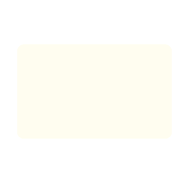

# Lottie animations

Looping Lottie animations built from the Frame 76 illustration set. Each one is a seamless
6.25s loop at 60fps with a **transparent background**, so it takes the colour of whatever
page or section it sits in.

| | | |
| --- | --- | --- |
|  |  |  |
| **frame76-canvas** — a design file assembling itself, two cursors working on it, then a reset | **frame76-window** — an app window opening, loading its content, then packing away | **frame76-phone** — a push notification dropping in over a phone, then flicked away |
|  |  |  |
| **frame76-editor** — code typing itself in, an error toast landing on the highlighted line | **frame76-flow** — a graph building in flow order, a pulse travelling each branch | **frame76-apps** — two app tiles spinning in and handing a pulse back and forth |

## Files

Every animation ships as three files plus its source illustration:

| file | what it is |
| --- | --- |
| `<name>.json` | the animation — drop this into Webflow, lottie-web, Figma, iOS or Android |
| `<name>.html` | self-contained player (play/pause, scrub, speed, light/dark) — just open it |
| `<name>.gif` | 30fps transparent flipbook, for READMEs and chats |
| `assets/<name>.svg` | the source illustration |

| animation | size | layers | json |
| --- | --- | --- | --- |
| frame76-canvas | 385x366 | 16 | ~62 KB |
| frame76-window | 386x366 | 9 | ~26 KB |
| frame76-phone | 399x382 | 2 | ~16 KB |
| frame76-editor | 386x366 | 8 | ~100 KB |
| frame76-flow | 385x366 | 10 | ~45 KB |
| frame76-apps | 515x325 | 6 | ~30 KB |

## Beat sheets

**canvas** — wireframe blocks stagger in · the selection frame draws itself, corner ticks pop
· **You** and **Me** arrive · You clicks the CTA and ripples fire · the avatar badge pops and
the connector slides out from the left edge · live: marching ants, presence pulses, cursor
drift · everything leaves in reverse.

**window** — the window opens · traffic lights pop one by one · chrome, then the media block
· the bird flies in, settles, its eye opens · tile, pane and bottom strip · loading: two
shimmer sweeps, the strip fills like a progress bar, the bird blinks, the green light blips
· packs away in reverse.

**phone** — the phone rises, notch and screen blocks stagger in · the notification drops from
above with a tilt and a shadow, overshooting before it settles · avatar pops, text wipes
open · it nudges for attention · then it is flicked up and away.

**editor** — the editor opens, lights pop, the logo lands · code types itself in line by line
· the highlighted line flashes as the error toast slides in from the right · the caret blinks
where the code stopped and the Go Live ring pulses · the code untypes in reverse.

**flow** — the start node pops and a pulse runs the connector · the card node fills in · the
decision diamond spins into place · pulses fan out along the three branches, each popping the
node it reaches · the error node keeps flashing while a second pulse run cycles · unwinds.

**apps** — the window fills with content · two app tiles spin in from opposite corners · a
pulse is handed from one to the other and answered on the way back, each tile kicking as it
sends · both spin back out.

## Regenerating

```bash
python3 build.py            # rebuilds every animation
python3 build_flow.py       # or just one
```

No dependencies — stdlib only.

**Playback speed** is one number: `TIME_SCALE` in `lottiekit.py`. It multiplies every
keyframe time and every loop length, so the whole set retimes together — 1.25 is the current
setting (375 frames at 60fps); 1.0 would be the original 5s pace. Scene files always keep
their timings in unscaled frames, so they never need touching.

| file | role |
| --- | --- |
| `lottiekit.py` | shared toolkit: shapes, easing, keyframes, SVG path parser, preview page |
| `build_*.py` | one scene per illustration — geometry and timeline |
| `build.py` | builds all of them |

Each scene parses its source SVG's path data directly, so the vector shapes stay identical to
the illustration; only geometry that needed semantic grouping is named explicitly. Timeline
constants sit near the top of each scene file.

Scenes drawn on the paper-coloured card have `SHOW_CARD = False`, which drops it. Set it to
`True` for the original opaque card. Two things to watch on a dark background: the canvas
scene's measurement frame, ticks and connector are black, and the phone scene's colours are
pre-blended for a light ground (the source draws that group at 81% opacity).

## Using them

```bash
npm i lottie-web
```

```js
import lottie from 'lottie-web';
import animationData from './frame76-flow.json';

lottie.loadAnimation({ container: el, renderer: 'svg', loop: true, autoplay: true, animationData });
```

React (`lottie-react`): `<Lottie animationData={data} loop />`.
Webflow: Add panel → Media → Lottie animation, upload the JSON, set Trigger to Autoplay and
Loop to infinite. Keep the SVG renderer — trim paths, dashes, gradients and masks all depend
on it.
Figma / After Effects: import the JSON through the LottieFiles plugin.

Built from plain shape layers — no expressions, images or fonts — so they render the same in
lottie-web, lottie-ios, lottie-android and rlottie. The `<name>.html` previews pull the player
from jsDelivr, so they need a connection the first time.
