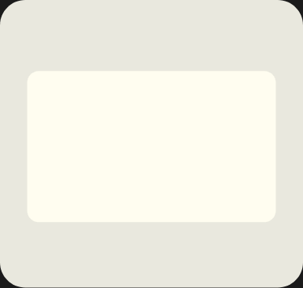

# Lottie animations

Looping Lottie animations built from the Frame 76 illustration set.

## frame76-canvas



The collaborative-canvas frame: a design file assembling itself, two cursors working on it
together, then the whole thing resetting. 5s, seamless — frame 300 is identical to frame 0,
so it loops with no visible cut.

**The background is transparent** — the animation takes on whatever colour sits behind it.
To put the original paper-coloured card back, set `SHOW_CARD = True` at the top of
`build.py` and re-run it. One thing to watch: the measurement frame, ticks and connector are
drawn in black, so they disappear on a dark background.

| file | what it is |
| --- | --- |
| `frame76-canvas.json` | the animation — 385x366, 60fps, 300 frames, 16 layers, ~62 KB |
| `preview.html` | self-contained player (play/pause, scrub, speed, light/dark) — just open it |
| `preview.gif` | 30fps flipbook of the loop, transparent, for READMEs and chats |
| `build.py` | generator — the JSON is built from here, not hand-edited |
| `assets/frame76-canvas.svg` | the source illustration |

### Beat sheet

| frames | beat |
| --- | --- |
| 0–42 | wireframe blocks stagger in from under the canvas edge; the purple CTA pops last |
| 30–70 | the selection frame draws itself around the artboard, corner ticks pop in one by one, measure line extends |
| 50–96 | **You** (red) flies in from off-canvas, **Me** (purple) comes up from the corner |
| 84 | You clicks the CTA — button presses, two red ripples fire |
| 86–116 | the avatar badge pops from its tail; the connector slides out from behind the left edge |
| 108–226 | live: marching ants run around the selection, presence pulses ring the avatar, both cursors drift |
| 214–292 | everything leaves in reverse order, back to the bare canvas |

### Regenerating

```bash
python3 build.py        # rewrites frame76-canvas.json and preview.html
```

No dependencies — stdlib only. Tweak the timeline constants near the top of the scene
section (`IN`, `OUT`, `SEL_IN`, `CLICK`, …) and re-run. `build.py` parses the source SVG's
path data directly, so the vector shapes stay identical to the illustration; only geometry
that needed semantic grouping (panels, cursors, badge) is named explicitly.

### Using it

```bash
npm i lottie-web
```

```js
import lottie from 'lottie-web';
import animationData from './frame76-canvas.json';

lottie.loadAnimation({ container: el, renderer: 'svg', loop: true, autoplay: true, animationData });
```

React (`lottie-react`): `<Lottie animationData={data} loop />`.
Web component: `<dotlottie-player src="frame76-canvas.json" autoplay loop>`.
Figma / After Effects: import the JSON through the LottieFiles plugin.

Built with plain shape layers, trim paths, dashes and masks — no expressions, images or
fonts — so it renders the same in lottie-web, lottie-ios, lottie-android and rlottie.
`preview.html` pulls the player from jsDelivr, so it needs a connection the first time.
