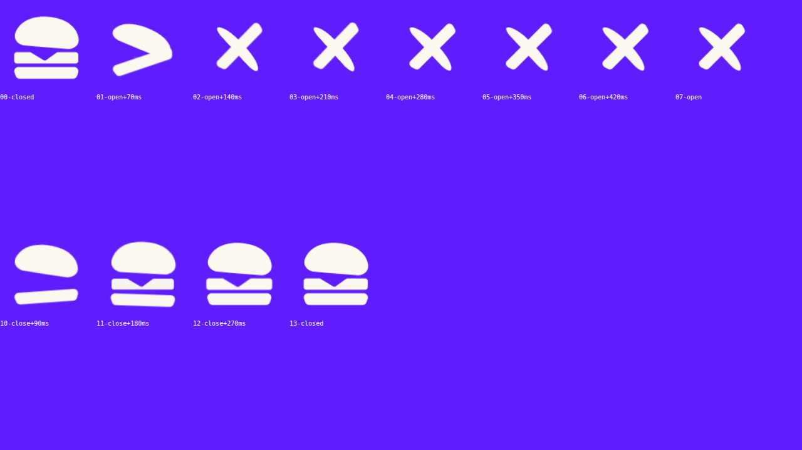

# Burger menu toggle



The burger icon comes apart into an X and back: the filling shoots out, then the two buns
swing across each other. Closing runs it in reverse, with the filling dropping back in last.

| file | what it is |
| --- | --- |
| `menu-toggle.html` | the component as SVG + CSS — paste the whole file into a Webflow Embed |
| `menu-toggle-lottie.html` | the same thing driven by Lottie, animation inlined — paste either one, not both |
| `menu-toggle.json` | the raw Lottie, frame 0 = burger, frame 30 = X |
| `build_menu.py` | generator for the Lottie |
| `assets/menu-toggle.svg` | the source icon |

## Use the HTML one

Paste `menu-toggle.html` into an Embed. That is the whole install — it carries its own CSS,
markup and a few lines of JS, and it adapts to where you put it.

**Inside Webflow's Navbar** (Navbar > Menu Button) it makes itself passive: Webflow keeps
handling the click and the icon only mirrors the navbar's open state, watching both the
`w--open` class on the menu button and the `data-nav-menu-open` attribute on the menu. Two
things fighting over one button is what makes these icons stick half-open, so the icon never
toggles itself there. It also hides Webflow's own menu icon and centres the open menu, using
the measured navbar height so the menu centres in the screen that is left rather than in a
full-height box hanging off the bottom. Delete the second `<style>` block to skip that part.

**Anywhere else** the button drives itself: it toggles `.is-open`, keeps `aria-expanded` and
its label in sync, and fires a `burger:toggle` event (`e.detail.open`). Add
`data-burger-target="#nav"` to put `.is-open` on your menu too.
- Restyle through `--size`, `--color` and `--speed` on `.burger`.
- `prefers-reduced-motion` is honoured: the state still changes, it just doesn't animate.

It is CSS transitions rather than a player, so an interrupted toggle reverses from wherever
it got to instead of jumping — which is what you want on a button people can spam.

## Or the Lottie one

`menu-toggle-lottie.html` is the same component with the Lottie doing the drawing. Paste it
the same way — the animation is inlined, so there is no file to upload and no interaction to
configure.

Use it instead of Webflow's native Lottie element rather than alongside it. That element
autoplays on load, which runs 0 → 30 and leaves the icon resting on the X; this one holds
frame 0 until the navbar opens, then plays forward, and reverses from wherever it got to if
you tap again mid-flight. Options: `data-size`, `data-color` (the colour is baked into the
JSON, so it gets rewritten at load), and `el.__burgerLottie` for the player instance.

`menu-toggle.json` on its own is the raw file if you want to drive it yourself: play 0 → 30
to open, 30 → 0 to close, no loop.

```bash
python3 build_menu.py        # rebuilds menu-toggle.json
```

The generator reuses the toolkit in `../lottie/lottiekit.py` and computes each piece's
bounding-box centre by sampling its curves, which is what `transform-box: fill-box` does in
the CSS version — so both turn around exactly the same points.

## Driving Webflow's own Lottie element

`webflow-lottie-onclick.js` is for the case where the animation is placed as a Webflow
**Lottie element** rather than through the embed above. That element autoplays on load, which
runs the whole transition and leaves the icon resting on the X, and its playback settings are
not exposed to the API — so the fix is to take the player over at runtime:

```js
var player = Webflow.require('lottie').lottie;          // Webflow's bodymovin instance
var anim = player.getRegisteredAnimations()             // the one inside .toggle_wrap
             .find(a => wrap.contains(a.wrapper));
anim.autoplay = false;
anim.goToAndStop(0, true);                              // hold the burger
```

then `setDirection(1|-1)` + `play()` on each click of the toggle, which reverses from
wherever it got to. It polls briefly for the player, because Webflow registers its animations
after its own init.

The toggle element is `.toggle_wrap` — change that selector if yours differs.

Paste it into a Code Embed rather than site custom code. An Embed runs in Webflow's Preview,
so the menu can be verified before anything is published; site custom code only runs on the
published site, which means a mistake in it is only discovered live. Nothing in the script is
allowed to throw either: the whole body sits in a try/catch and it never uses `Webflow.push`,
so even if it fails outright the menu still opens.

## The geometry

Everything rotates about its own centre, then moves to where the strokes cross (22.5, 21.5):

| piece | open state |
| --- | --- |
| bun | `translate(-.7, 9.7) rotate(45deg) scale(.92, .36)` — the dome flattens into a stroke |
| base | `translate(.3, -17) rotate(-45deg) scaleX(.92)` |
| filling | `scale(.15)`, faded out |
